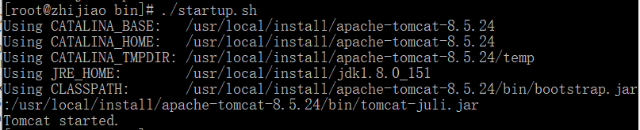

#### 下载地址
[https://tomcat.apache.org/download-80.cgi#8.5.24](https://tomcat.apache.org/download-80.cgi#8.5.24)

#### 1，解压文件夹
`# tar -zxvf /software/apache-tomcat-7.0.54.tar.gz`

#### 2.进入bin目录启动tomcat
`# cd /usr/local/tomcat/server/bin`  
`#  ./startup.sh`
 

#### 3，测试Tomcat
##### a)  打开防火墙,使外部能访问
`# /sbin/iptables -I INPUT -p tcp --dport 8080 -j ACCEPT`  
`# service iptables save`  
`# service iptables restart`  

##### b)或直接修改文件/etc/sysconfig/iptables
`# vi /etc/sysconfig/iptables`
   
加入：`-A INPUT -p tcp -m tcp --dport 8080 -j ACCEPT`  
保存退出：`ESC+:wq`  
重启：`# service iptables restart`

在浏览器输入: http://192.168.16.133:8080
如在本机可以输入: http://localhost:8080
出现tomcat的页面表示安装成功

#### 4，停止Tomcat（注意是在bin目录下）
`# ./shutdown.sh`

#### 5，环境变量配置
`# vi ~/.bash_profile`  
加入下面两句话，路径改成你的tomcat所在路径：  
`export CATALINA_BASE=/usr/local/tomcat`  
`export CATALINA_HOME=/usr/local/tomcat`  
保存退出：  `ESC+:wq`  
重新加载环境变量：   `# source ~/.bash_profile`